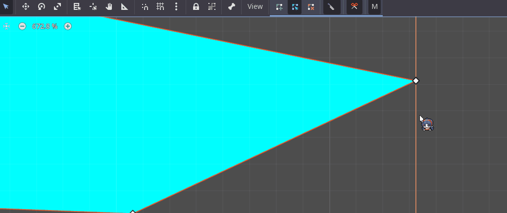
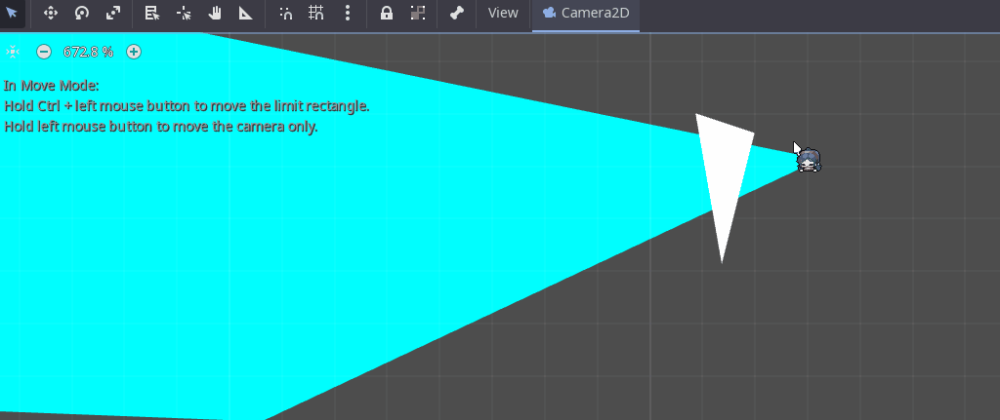
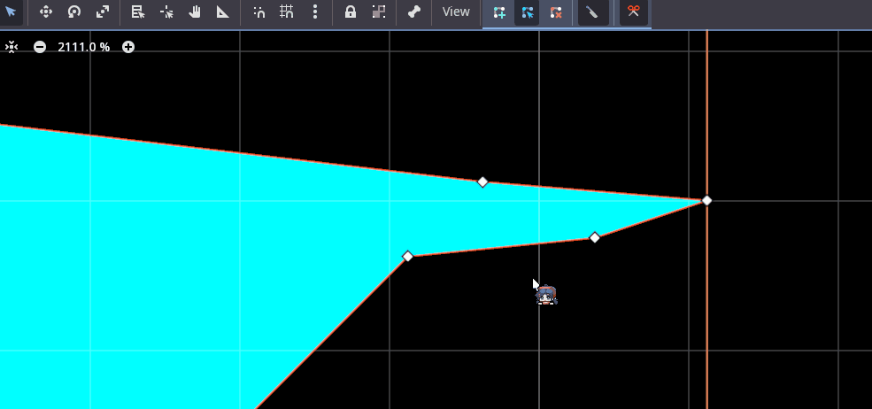
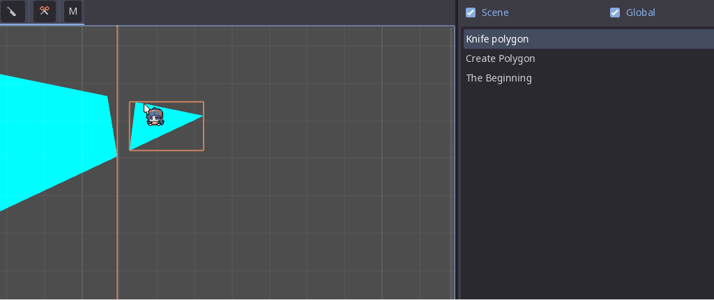
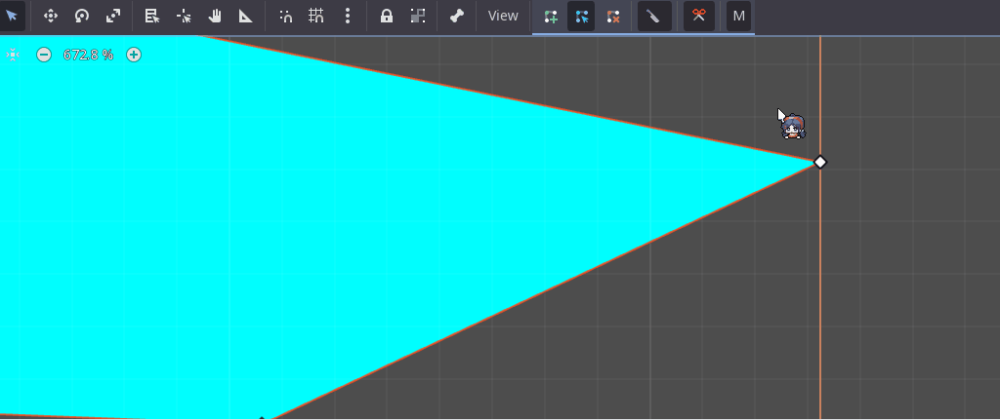

## CPolygon - Smart Polygon Tools for Godot Engine

CPolygon is a Godot Engine plugin that provides tools to simplify polygon editing.

1. Cut
2. Knife
3. Merge (Simple A+B)

### Features:

- **Cut (Subtraction):** The "Cut" operation allows you to subtract one polygon (B) from another polygon (A). This operation is visualized as **A - B**.

  You can perform the "Cut" operation in two ways:

  1.  **Using Wait Polygon (Interactive Creation):**

      - Select the target Polygon2D (A) in the editor.
      - Press the "Cut" button in the editor toolbar.
      - A new Polygon2D will be created as a child of the selected polygon. You can now adjust the shape of this new polygon directly in the editor viewport. This new polygon represents polygon (B).
      - Once you are satisfied with the shape of polygon (B), **deselect** the new polygon. The "Cut" operation (A - B) will be automatically applied to the target polygon (A), and polygon (B) will be removed.

      

  2.  **Using Two Selected Polygons:**

      - Select **two** Polygon2D nodes in the editor. The **first selected** polygon will be the target polygon (A), and the **second selected** polygon will be the cutting polygon (B).
      - Press the "Cut" button.
      - The "Cut" operation (A - B) will be applied to the first selected polygon (A), and polygon (B) (the second selected one) will **remain** unchanged.

      

- **Knife:** The "Knife" operation calculates the overlapping area of two polygons (A and B). This operation is visualized as **A ∩ B**.

  To perform the "Knife" operation:

  1.  Select the target Polygon2D (A) in the editor.
  2.  Press the "Knife" button in the editor toolbar.
  3.  Similar to the "Cut" operation, a new Polygon2D will be created as a child of the selected polygon. Adjust this new polygon (B) to define the intersection area.
  4.  **Deselect** the new polygon. The "Knife" operation (A ∩ B) will be applied to the target polygon (A), and polygon (B) will be removed.

      
      

- **Merge (Simple A+B):** The "Merge" operation allows you to combine two polygons (A and B) into one. This operation is visualized as **A + B**.

  To perform the "Merge" operation:

  1. Select **two** Polygon2D nodes in the editor.
  2. Press the "Merge" button in the editor toolbar.
  3. The "Merge" operation will combine the selected polygons into a single polygon node.

  

- **Undo/Redo Support:** All operations are fully integrated with Godot's Undo/Redo system. You can easily undo and redo polygon modifications.

- **Cancel**: You can cancel an operation by remove the polygon that is being created or modified.

### Planned Features:

- **Improve convenience:** More intuitive and user-friendly interfaces for the "Cut," "Knife," and "Merge" operations.

### Installation:

1.  Copy the `cpolygon` folder into the `addons` folder in your Godot project.
2.  Enable the plugin in Project Settings -> Plugins.

### Usage:

1.  Select a Polygon2D node in the 2D editor viewport.
2.  The "Cut," "Knife," and "Merge" buttons will appear in the editor toolbar (Canvas Editor menu).
3.  Click the "Cut," "Knife," or "Merge" button to perform the corresponding operation, following the instructions above for each feature.

### Contribution and Feedback:

This plugin is under active development. Feedback, bug reports, and suggestions for new features are welcome! Feel free to contribute through GitHub or contact the author.
